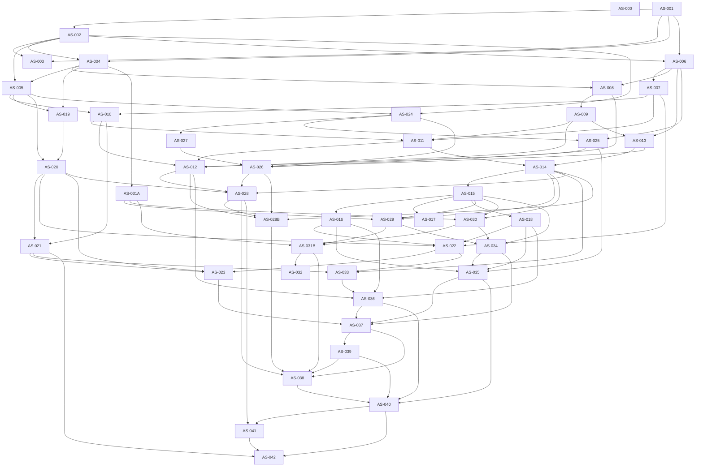

# Issue Dependency Graph

Generated by `scripts/validate_package.py --regenerate`. The execution order in
`ISSUE_BACKLOG.csv` is verified to be a topological order of this graph.

```mermaid
graph TD
    AS000["AS-000"]
    AS001["AS-001"]
    AS002["AS-002"]
    AS003["AS-003"]
    AS004["AS-004"]
    AS005["AS-005"]
    AS006["AS-006"]
    AS007["AS-007"]
    AS008["AS-008"]
    AS009["AS-009"]
    AS010["AS-010"]
    AS011["AS-011"]
    AS012["AS-012"]
    AS013["AS-013"]
    AS014["AS-014"]
    AS015["AS-015"]
    AS016["AS-016"]
    AS017["AS-017"]
    AS018["AS-018"]
    AS019["AS-019"]
    AS020["AS-020"]
    AS021["AS-021"]
    AS022["AS-022"]
    AS023["AS-023"]
    AS031A["AS-031A"]
    AS029["AS-029"]
    AS030["AS-030"]
    AS031B["AS-031B"]
    AS032["AS-032"]
    AS033["AS-033"]
    AS024["AS-024"]
    AS027["AS-027"]
    AS025["AS-025"]
    AS026["AS-026"]
    AS028["AS-028"]
    AS028B["AS-028B"]
    AS034["AS-034"]
    AS035["AS-035"]
    AS036["AS-036"]
    AS037["AS-037"]
    AS039["AS-039"]
    AS038["AS-038"]
    AS040["AS-040"]
    AS041["AS-041"]
    AS042["AS-042"]
    AS001 --> AS002
    AS001 --> AS003
    AS002 --> AS003
    AS001 --> AS004
    AS002 --> AS004
    AS002 --> AS005
    AS004 --> AS005
    AS001 --> AS006
    AS002 --> AS006
    AS006 --> AS007
    AS004 --> AS008
    AS006 --> AS008
    AS008 --> AS009
    AS005 --> AS010
    AS007 --> AS010
    AS007 --> AS011
    AS009 --> AS011
    AS010 --> AS011
    AS008 --> AS012
    AS009 --> AS012
    AS010 --> AS012
    AS011 --> AS012
    AS006 --> AS013
    AS009 --> AS013
    AS011 --> AS014
    AS013 --> AS014
    AS014 --> AS015
    AS015 --> AS016
    AS015 --> AS017
    AS015 --> AS018
    AS004 --> AS019
    AS005 --> AS019
    AS019 --> AS020
    AS005 --> AS020
    AS010 --> AS021
    AS020 --> AS021
    AS007 --> AS022
    AS020 --> AS022
    AS016 --> AS022
    AS018 --> AS022
    AS020 --> AS023
    AS021 --> AS023
    AS022 --> AS023
    AS004 --> AS031A
    AS014 --> AS029
    AS015 --> AS029
    AS031A --> AS029
    AS014 --> AS030
    AS015 --> AS030
    AS031A --> AS030
    AS029 --> AS031B
    AS030 --> AS031B
    AS031A --> AS031B
    AS031B --> AS032
    AS014 --> AS033
    AS021 --> AS033
    AS022 --> AS033
    AS002 --> AS024
    AS005 --> AS024
    AS024 --> AS027
    AS006 --> AS025
    AS024 --> AS025
    AS013 --> AS026
    AS024 --> AS026
    AS025 --> AS026
    AS027 --> AS026
    AS020 --> AS028
    AS026 --> AS028
    AS014 --> AS028
    AS012 --> AS028
    AS012 --> AS028B
    AS014 --> AS028B
    AS026 --> AS028B
    AS028 --> AS028B
    AS015 --> AS034
    AS029 --> AS034
    AS030 --> AS034
    AS025 --> AS035
    AS034 --> AS035
    AS016 --> AS035
    AS018 --> AS035
    AS012 --> AS036
    AS016 --> AS036
    AS018 --> AS036
    AS033 --> AS036
    AS034 --> AS037
    AS035 --> AS037
    AS036 --> AS037
    AS023 --> AS037
    AS037 --> AS039
    AS028 --> AS038
    AS028B --> AS038
    AS031B --> AS038
    AS037 --> AS038
    AS039 --> AS038
    AS035 --> AS040
    AS036 --> AS040
    AS038 --> AS040
    AS039 --> AS040
    AS028 --> AS041
    AS040 --> AS041
    AS021 --> AS042
    AS040 --> AS042
    AS041 --> AS042
```
